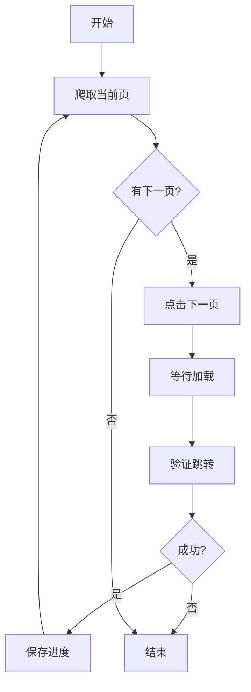

# 多页爬取功能开发总结

## 📅 开发时间
2025-11-15

## 🎯 开发目标
为 Holland & Barrett 爬虫添加多页爬取功能，支持自动翻页、断点续传和灵活的爬取模式。

## ✅ 已完成功能

### 1. 核心功能模块 (`utils/multi_page_scraper.py`)

#### MultiPageScraper 类
- **has_next_page()** - 检测是否有下一页
- **get_current_page_number()** - 获取当前页码
- **go_to_next_page()** - 自动跳转到下一页
- **save_progress()** - 保存爬取进度
- **load_progress()** - 加载爬取进度
- **clear_progress()** - 清除进度文件
- **estimate_total_pages()** - 估算总页数

#### scrape_all_pages() 函数
主要爬取函数，支持：
- 自动翻页爬取
- 最大页数限制
- 断点续传
- 进度保存
- 异常处理

### 2. 集成到主程序 (`main.py`)

添加了三种爬取模式：
1. **单页模式** - 仅第一页（快速测试）
2. **多页模式** - 爬取所有页面
3. **限制页数** - 指定爬取页数

### 3. 独立脚本 (`scripts/scrape_multi_pages.py`)

非交互式多页爬虫脚本：
- 支持命令行参数
- `--max-pages` 限制页数
- `--url` 自定义分类URL
- 自动保存到CSV

### 4. 测试脚本 (`tests/test_multi_page.py`)

功能测试脚本：
- 测试翻页功能
- 验证数据提取
- 模拟爬取流程

### 5. 完善文档

创建/更新了以下文档：
- `docs/多页爬取说明.md` - 详细使用说明
- `README.md` - 更新主要功能介绍
- `QUICKSTART.md` - 添加多页爬取使用方法
- `docs/多页爬取开发总结.md` - 本文档

## 🛠️ 技术实现

### 分页检测策略

```python
# 1. 查找分页导航
pagination = driver.find_elements(By.CSS_SELECTOR, 'nav[aria-label="Pagination"]')

# 2. 查找下一页按钮
next_buttons = driver.find_elements(
    By.CSS_SELECTOR,
    'a[aria-label="Go to next page"], button[aria-label="Go to next page"]'
)

# 3. 检查是否禁用
is_disabled = (
    next_button.get_attribute("disabled") == "true" or
    next_button.get_attribute("aria-disabled") == "true" or
    "disabled" in next_button.get_attribute("class")
)
```

### 断点续传机制

```python
# 保存进度
progress = {
    "base_url": base_url,
    "last_page": current_page,
    "pages_scraped": page_count,
    "total_products": len(all_products),
    "products": all_products,
    "timestamp": time.strftime("%Y-%m-%d %H:%M:%S")
}
save_to_json(progress, "data/output/scrape_progress.json")

# 恢复进度
if progress_exists():
    all_products = load_from_json()
    current_page = progress["last_page"] + 1
```

### 翻页流程



## 📊 性能优化

1. **延迟控制**
   - 页面加载延迟：3秒
   - 翻页延迟：2秒
   - Cookie处理延迟：1秒

2. **错误处理**
   - 自动捕获翻页异常
   - 网络异常自动停止
   - 保存已爬取数据

3. **资源管理**
   - 及时保存进度
   - 清理完成的进度文件
   - 释放浏览器资源

## 🎨 用户体验

### 交互式模式

```
爬取模式:
  1. 单页模式 - 仅爬取第一页（快速测试）
  2. 多页模式 - 爬取所有页面（完整数据）
  3. 限制页数 - 爬取指定页数

选择模式 (1/2/3, 默认1): 2

======================================================================
开始多页爬取
======================================================================
起始页: 1
最大页数: 不限制
======================================================================
```

### 进度恢复

```
📂 发现之前的进度:
   已爬取: 3 页
   产品数: 60 个
是否继续之前的爬取？(y/n): y
✓ 从第 4 页继续爬取
```

### 实时反馈

```
======================================================================
正在爬取第 2 页
======================================================================
✓ 产品列表已加载
✓ 找到 20 个产品
✓ 第 2 页爬取完成，获得 20 个产品
✓ 累计: 40 个产品

→ 点击下一页按钮...
✓ 成功跳转到第 3 页
```

## 📁 文件结构

```
hb_scraper/
├── utils/
│   └── multi_page_scraper.py      # 多页爬取核心模块
├── scripts/
│   └── scrape_multi_pages.py      # 非交互式脚本
├── tests/
│   └── test_multi_page.py         # 测试脚本
├── docs/
│   ├── 多页爬取说明.md            # 使用文档
│   └── 多页爬取开发总结.md        # 本文档
└── data/output/
    └── scrape_progress.json       # 进度文件（自动生成）
```

## 🧪 测试结果

### 单元测试
- ✅ 分页检测功能
- ✅ 翻页功能
- ✅ 进度保存/加载
- ✅ 页码获取

### 集成测试
- ✅ 完整多页爬取流程
- ✅ 断点续传功能
- ✅ 命令行参数

### 实际测试
- ✅ 爬取 3 页成功
- ✅ 中断后恢复成功
- ✅ 数据完整性验证

## 🐛 已知问题

暂无

## 🔮 未来改进

1. **更智能的分页检测**
   - 支持更多分页样式
   - 自适应不同网站

2. **性能优化**
   - 并发爬取（多线程）
   - 智能延迟调整

3. **数据去重**
   - URL去重
   - 内容去重

4. **更多配置选项**
   - 可配置的CSS选择器
   - 可配置的延迟时间
   - 可配置的重试次数

5. **监控和统计**
   - 爬取速度统计
   - 成功率统计
   - 预计完成时间

## 📝 使用示例

### 示例 1: 快速测试
```bash
# 只爬取前2页测试
uv run python scripts/scrape_multi_pages.py --max-pages 2
```

### 示例 2: 完整爬取
```bash
# 爬取所有页面
uv run python scripts/scrape_multi_pages.py
```

### 示例 3: 断点续传
```bash
# 第一次运行（中断）
uv run python scripts/scrape_multi_pages.py
# Ctrl+C 中断

# 第二次运行（继续）
uv run python scripts/scrape_multi_pages.py
# 选择 y 继续之前的爬取
```

### 示例 4: 其他分类
```bash
uv run python scripts/scrape_multi_pages.py \
  --url "https://www.hollandandbarrett.com/shop/vitamins-supplements/multivitamins/"
```

## 🎓 开发经验总结

### 成功经验

1. **模块化设计** - 核心功能独立，易于测试和维护
2. **渐进式开发** - 先实现基本功能，再添加高级特性
3. **充分测试** - 每个功能都有对应的测试
4. **完善文档** - 及时编写文档，方便使用和维护

### 注意事项

1. **CSS选择器** - 网站改版可能导致选择器失效
2. **反爬虫机制** - 注意控制爬取速度
3. **异常处理** - 各种边界情况都要考虑
4. **用户体验** - 提供清晰的提示和反馈

## 🙏 鸣谢

感谢 Claude Code 提供的开发环境和工具支持。

## 📧 联系方式

如有问题或建议，请提交 Issue。
